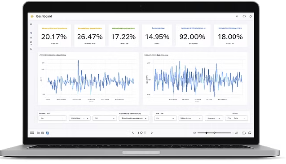
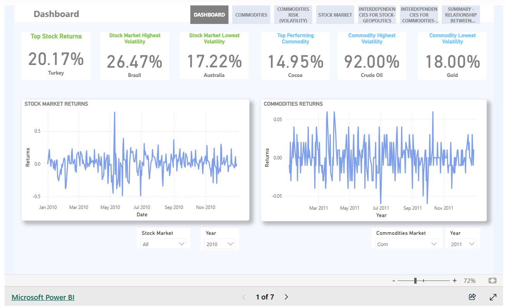
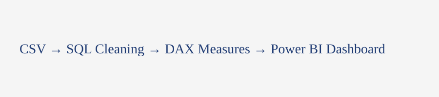

# Market Trends & Performance Dashboard

Interactive business intelligence dashboard analysing global market trends, stock performance, commodity behaviour, and financial relationships using Power BI and data analytics.
<br>


<p align="center">
  
</p>

<p align="center">


</p>

---

## Live Dashboard

[View Interactive Dashboard](PASTE_POWER_BI_LINK_HERE)

---

# INTERACTIVE DASHBOARD

Explore the dashboard to analyse market trends, asset performance, and relationships across global financial markets and commodities.

The dashboard includes a live interactive experience, enabling users to:
- compare stock market performance,
- analyse commodity trends,
- identify volatility patterns,
- explore cross-market relationships in real time.

---

# OVERVIEW

This project explores the relationship between global stock markets and commodities using interactive data visualisation and financial analytics.

The dashboard enables users to:
- identify performance trends,
- compare market behaviour,
- analyse volatility,
- explore correlations between assets,
- understand how commodities and global markets respond to economic conditions and uncertainty.

The project combines data analysis, financial reporting, and interactive business intelligence into a single analytical solution.

---

# DASHBOARD PREVIEW

<p align="center">
  
</p>

---

# THE PROBLEM

Financial market data is highly complex and often fragmented across multiple sources.

Without clear visualisation and analytical reporting:
- identifying trends becomes time-consuming,
- comparing asset behaviour is difficult,
- volatility patterns are harder to interpret,
- market correlations require extensive manual analysis.

Businesses, analysts, and investors need accessible ways to interpret financial data quickly and effectively.

---

# THE SOLUTION

Developed an interactive Power BI dashboard integrating stock market and commodity data into a single analytical environment.

The dashboard allows users to:
- dynamically explore market performance,
- compare asset trends,
- identify correlations,
- analyse volatility,
- monitor financial behaviour across regions and asset classes.

The solution transforms raw financial data into actionable market insights through interactive visualisation.

---

# KEY FEATURES

- Interactive Power BI dashboard
- Cross-market performance tracking
- Commodity and stock market comparison
- Correlation and volatility analysis
- Interactive filtering by:
  - region,
  - asset type,
  - timeframe
- Trend analysis across multiple financial indicators
- Executive-style dashboard reporting

---

# KEY INSIGHTS

- Market relationships vary across regions and asset classes
- Energy commodities demonstrate high volatility and strong market influence
- Gold shows greater stability during periods of market uncertainty
- Clear correlation patterns exist between major global financial markets
- Certain commodities respond differently to economic events and market shifts
- Interactive filtering improves comparative financial analysis

---

# TECHNICAL APPROACH

Financial data was cleaned, transformed, and analysed before visualisation in Power BI.

The workflow included:
- data preparation,
- transformation,
- aggregation,
- analytical modelling,
- dashboard visualisation.

The project demonstrates the end-to-end business intelligence process from raw financial data to interactive reporting.

---

# TOOLS USED

- Power BI
- Python
- Google BigQuery
- Google Sheets
- Data modelling
- Data visualisation
- Financial analytics

---

# DATA PIPELINE

<p align="center">
  
</p>

---

# DATASET

The project combines global market and commodity datasets including:
- stock market indices,
- commodity pricing,
- historical market performance,
- volatility indicators,
- asset trend data.

The data was structured and transformed to support interactive dashboard reporting and financial analysis.

---

# DASHBOARD METRICS

The dashboard analyses:
- market performance,
- commodity trends,
- asset volatility,
- correlation patterns,
- performance over time,
- comparative market analysis.

---

# REPOSITORY STRUCTURE

```text
market-trends-performance-dashboard/
│
├── data/
│   ├── raw/
│   └── processed/
│
├── dashboard/
│   └── Market_Trends_Performance_Dashboard.pbix
│
├── sql/
├── dax/
├── images/
├── docs/
│
├── README.md
└── LICENSE
```

---

# HOW TO USE THIS PROJECT

1. Download the repository
2. Open the `.pbix` dashboard file in Power BI Desktop
3. Connect the dashboard to the dataset if required
4. Explore dashboard visuals and interactive filters
5. Review SQL and analytical documentation inside the repository

---

# LINKS

### GitHub Repository
https://github.com/smlumpa/market-trends-performance-dashboard

### Live Power BI Dashboard
PASTE_POWER_BI_LINK_HERE

---

# AUTHOR

Sophia Lumpa  
Business
